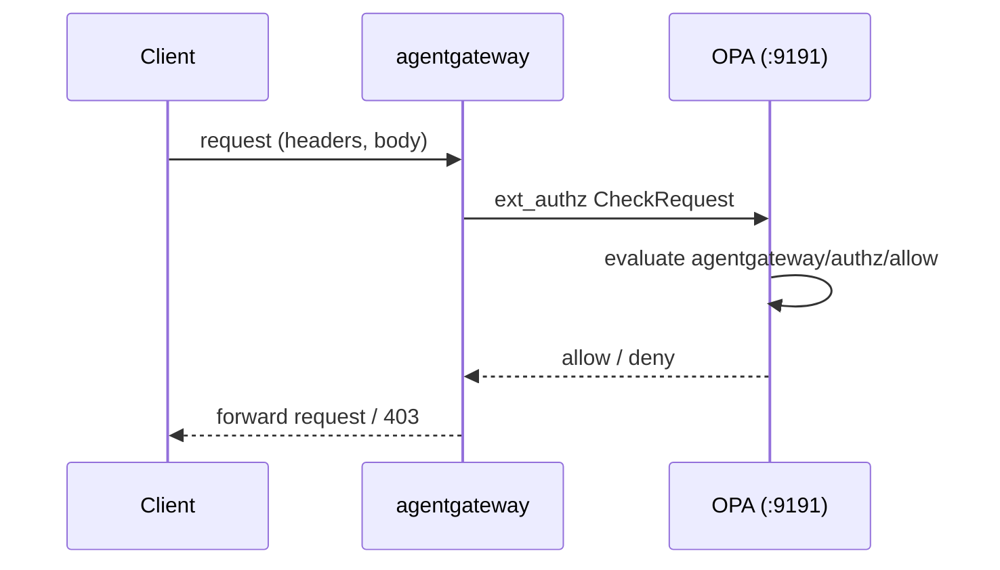

# opa-ext-authz

A thin packaging of [Open Policy Agent](https://www.openpolicyagent.org/) as an `ext_authz` authorization service for [agentgateway](https://agentgateway.dev).

There is **no custom code** here.

OPA ships an official build with the `envoy_ext_authz_grpc` plugin compiled in, and it speaks the `ext_authz` v3 gRPC protocol natively. This repo just layers Rego authorization policies and static relationship data on top of that image, plus the config that wires up the plugin. (Contrast the sibling `openfga-ext-authz`, which needs a custom Go gRPC adapter because OpenFGA has no native ext_authz support.)

The demo scenario is a relationship-based access control (ReBAC) model deciding which users may call which LLM models, mirroring the OpenFGA sibling demo with identical relationships and identical allow/deny outcomes.

## How it works



1. agentgateway is configured with an `extAuth` policy whose `backendRef` points at this service's gRPC port (`9191`) and which forwards the request body (`forwardBody`) so the policy can read the requested model.
2. For each proxied request, agentgateway sends OPA an ext_authz `CheckRequest`. OPA exposes it to Rego as the `input` document, notably:
   - `input.attributes.request.http.headers["x-user-id"]` - the caller identity (header keys arrive already lowercased).
   - `input.attributes.request.http.body` - the raw request body as a JSON string.
   - `input.attributes.request.http.method` / `.path` - also available.
3. OPA evaluates the configured decision path `agentgateway/authz/allow`, which resolves to `data.agentgateway.authz.allow` (rule `allow` in package `agentgateway.authz`). `true` allows the request, `false`/undefined denies it.

## Configuration

The plugin is configured in [`config/opa-config.yaml`](config/opa-config.yaml):

| Key                                              | Value                      | Purpose                                              |
| ------------------------------------------------ | -------------------------- | ---------------------------------------------------- |
| `plugins.envoy_ext_authz_grpc.addr`              | `:9191`                    | gRPC listen address (the ext_authz backendRef port). |
| `plugins.envoy_ext_authz_grpc.path`              | `agentgateway/authz/allow` | Decision path -> `data.agentgateway.authz.allow`.    |
| `plugins.envoy_ext_authz_grpc.dry-run`           | `false`                    | Enforce decisions (`true` would allow all).          |
| `plugins.envoy_ext_authz_grpc.enable-reflection` | `true`                     | gRPC reflection for grpcurl during demos.            |
| `decision_logs.console`                          | `true`                     | Log each decision to the container logs.             |

The container also serves OPA's HTTP APIs on `8181` (health, Data API, metrics).

## Running locally

Build and run the image (serves the ext_authz gRPC plugin on `9191` and OPA's HTTP API on `8181`):

```bash
make run-local
# equivalently:
docker build -t opa-ext-authz:local .
docker run --rm -p 8181:8181 -p 9191:9191 opa-ext-authz:local
```

Check health and exercise the decision over the HTTP Data API (the same `input` shape agentgateway sends over gRPC):

```bash
curl -s localhost:8181/health

curl -s localhost:8181/v1/data/agentgateway/authz/allow \
  -H 'content-type: application/json' \
  -d '{"input":{"attributes":{"request":{"http":{"headers":{"x-user-id":"alice"},"body":"{\"model\":\"gpt-4o\"}"}}}}}'
# => {"result":true}
```

## Development

Requires the [`opa`](https://www.openpolicyagent.org/docs/#running-opa) CLI (`brew install opa`).

```bash
make test    # opa test policies/ -v   (unit tests for all scenarios)
make lint    # opa fmt --list --diff policies/ && opa check policies/
make fmt     # opa fmt -w policies/
```

You can also evaluate the decision path directly against a mock input:

```bash
echo '{"attributes":{"request":{"http":{"headers":{"x-user-id":"bob"},"body":"{\"model\":\"claude-sonnet-5\"}"}}}}' \
  | opa eval -d policies/ -I -f raw 'data.agentgateway.authz.allow'
# => true
```

## MCP API-key demo

`policies/mcp_authz.rego` adds a second, independent `allow` branch to the same `agentgateway.authz` package (Rego lets a package span multiple files) for a separate demo: gating an MCP route with a plain API key instead of the ReBAC model above.

- `input.attributes.request.http.headers["x-api-key"]` - the caller-supplied key (header keys arrive already lowercased).
- The key must appear in `data.mcp_valid_api_keys` (see [`policies/data.json`](policies/data.json)).

Both demos are served by the same running OPA pod under the same decision path (`agentgateway/authz/allow`) - a request is allowed if _either_ branch matches, so the two demos never interfere with each other.

```bash
curl -s localhost:8181/v1/data/agentgateway/authz/allow \
  -H 'content-type: application/json' \
  -d '{"input":{"attributes":{"request":{"http":{"headers":{"x-api-key":"demo-mcp-api-key-12345"}}}}}}'
# => {"result":true}
```

## Wiring into agentgateway

Route ext_authz to this service with an `EnterpriseAgentgatewayPolicy` (the Service must resolve to this container's gRPC port `9191`):

```yaml
apiVersion: enterpriseagentgateway.solo.io/v1alpha1
kind: EnterpriseAgentgatewayPolicy
metadata:
  name: opa-authz
spec:
  traffic:
    extAuth:
      backendRef:
        name: opa-ext-authz
        namespace: enterprise-agentgateway
        kind: Service
        port: 9191
      # forward the request body so the policy can read the model
      forwardBody:
        maxSize: 8192
      grpc:
        contextExtensions:
          service: agentgateway
```

## License

Apache License 2.0 - see [LICENSE](LICENSE).
